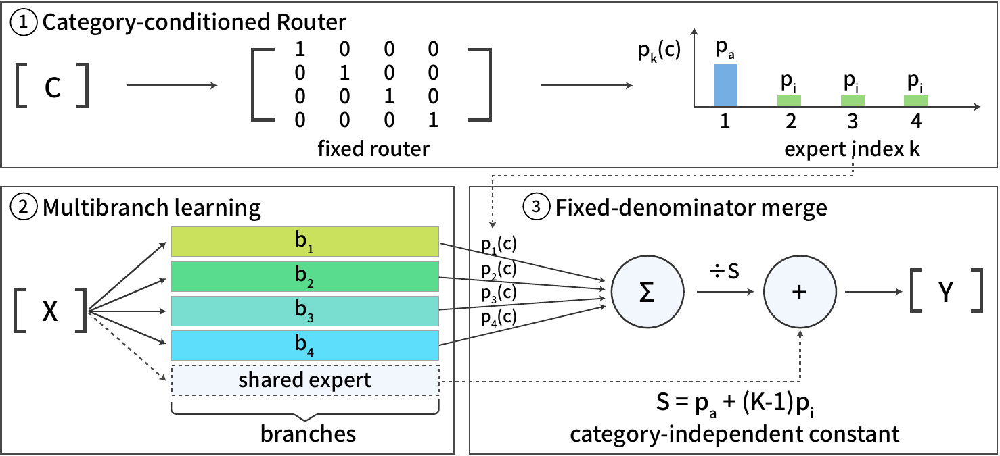

# SpecDrop: Parameter-Free Category-Conditioned Routing for Modular Specialization

Official PyTorch implementation for the "SpecDrop: Parameter-Free Category-Conditioned Routing for Modular Specialization" paper

> *Granularity alignment, not algorithm choice, localizes when routing helps.*

<p align="center">
    📃 <a href="https://arxiv.org/abs/2608.04084" target="_blank">Paper</a> <br>
</p>



The current release supports:

- Soft SpecDrop training and evaluation across four settings: CIFAR-100 (ResNet-110), ImageNet-1K under the BREEDS-46 partition (ViT-S/16), SlimPajama-6B language modeling (30M / 125M Transformer LM), and SuperNI instruction tuning (Llama-3.2-1B + LoRA).
- Every baseline in the paper's main tables: dense references, architecture-matched No-Routing(+SE) controls, HardCategory, Stochastic Depth, Example-Tied Dropout, Contextual Dropout, Soft MoE (deployed / tuned second-half / compute-matched), Mod-Squad, the auxiliary-loss-free top-k router, COMET, Switch, Hash Layers, SMoE-Dropout, DEMix, single LoRA, LoRAMoE, MoCLE, and HydraLoRA.
- The paper's evaluation controls and analysis tooling: the information-matched logit-masking control, label-quality sweeps, branch–category alignment via pruning sensitivity, and per-method MACs / wall-clock accounting.
- One-command reproduction of every main-table result (Tables 1–4 and their Align columns) via `reproduce.sh`, with per-cell auto-skip on resume and 460 unit tests.

## Contents
- [SpecDrop: Parameter-Free Category-Conditioned Routing for Modular Specialization](#specdrop-parameter-free-category-conditioned-routing-for-modular-specialization)
	- [Contents](#contents)
	- [Install](#install)
	- [Usage](#usage)
	- [Datasets](#datasets)
	- [Results](#results)
	- [Reference](#reference)
	- [License](#license)

## Install
1. Clone the repository and navigate to the SpecDrop working directory
```bash
git clone https://github.com/Beryex/SpecDrop.git --depth 1
cd SpecDrop
```
2. Set up the environment
```bash
conda create -n SpecDrop python=3.12 -y
conda activate SpecDrop
pip install -r requirements.txt
```
3. (Optional) Verify the environment with a smoke run covering all four settings (~10 min warm; ~30–50 min on a first run). First-run caveat: the smoke itself triggers the one-time dataset downloads — small for CIFAR/LoRA (gated Llama-3.2-1B base + ~400 MB SuperNI clone), large for NLP/ViT (SlimPajama ~24 GB; ImageNet-1K ~150 GB, gated) — so populate the big caches in advance or start with the cifar/lora smokes.
```bash
bash reproduce.sh smoke
```

Training metrics are logged to Weights & Biases by default: run `wandb login` once, or `export WANDB_MODE=offline` to skip it.

## Usage

`reproduce.sh` is the single entry point; each target reproduces one paper table end-to-end (its ablation chains plus the main-table runs, 3 seeds), skipping any cell whose `results.json` already exists (the LoRA chain additionally checks that the metric is populated). The wall-clock figures below are for the main-table runs alone; for table-only reproduction, run `bash scripts/experiments/<setting>/main_table.sh` directly with the paper's operating point exported when the ablation markers are absent:

```bash
# vit/lora read the operating point from the sweep markers; when skipping the
# ablation chains, export the paper's values instead:
BEST_PA=0.6 BEST_BETA=1 BEST_SE=2.0  bash scripts/experiments/vit/main_table.sh
BEST_PA=0.8 BEST_BETA=1 BEST_SE=1.0  bash scripts/experiments/lora/main_table.sh
# cifar/nlp main tables hardcode the paper operating point and need no env vars.
```

```bash
bash reproduce.sh cifar          # Table 1: CIFAR-100
bash reproduce.sh vit            # Table 2: ImageNet-1K BREEDS ViT  ← longest; multi-GPU recommended
bash reproduce.sh nlp            # Table 3: SlimPajama-6B LM
bash reproduce.sh lora           # Table 4: SuperNI Llama-3.2-1B + LoRA
bash reproduce.sh alignment      # Align columns of Tables 1–4 (after the four above complete);
                                 # summary table: python scripts/aggregate_alignment.py
```

`bash reproduce.sh --help` lists every target with its expected wall-clock. Seeds are independent, so the standard multi-GPU pattern is one seed per GPU:

```bash
CUDA_VISIBLE_DEVICES=0 SEEDS_OVERRIDE=42  bash scripts/experiments/cifar/main_table.sh &
CUDA_VISIBLE_DEVICES=1 SEEDS_OVERRIDE=123 bash scripts/experiments/cifar/main_table.sh &
CUDA_VISIBLE_DEVICES=2 SEEDS_OVERRIDE=456 bash scripts/experiments/cifar/main_table.sh &
wait
```

All paper numbers were produced on NVIDIA RTX 5090 (32 GB, bf16); any ≥24 GB bf16-capable GPU reproduces them within seed noise.

| Setting | Single-GPU wall-clock (3 seeds) | Multi-GPU shortcut |
|---|---|---|
| CIFAR-100 (Tab 1) | ~18 h | 3 GPUs × 1 seed each → ~6 h |
| ImageNet ViT-S/16 (Tab 2) | ~630 h | 3 GPUs → ~210 h (recommended) |
| SlimPajama 30M LM (Tab 3) | ~150 h | 3 GPUs → ~50 h |
| SuperNI Llama-1B + LoRA (Tab 4) | ~290 h | 3 GPUs → ~95 h |
| Branch–category alignment | ~24 h | 6 GPUs (per-method shards) → ~4 h |

<details>
<summary><b>Repository layout</b></summary>

```
.
├── reproduce.sh                # single entry: bash reproduce.sh <target>
├── algorithms/                 # routing rules (the methodological surface)
│   ├── soft_specdrop.py        # ours (per-cat soft mask + cosine warmup, optional shared expert)
│   ├── no_dropout.py           # all-branches-equal baseline
│   ├── hard_category.py        # one-hot category routing baseline
│   └── ...                     # Soft MoE, Mod-Squad, SMoE-Dropout, Switch, Hash, COMET, ETD, Contextual, Stoch. Depth
├── models/                     # per-setting backbones + baseline model classes
│   ├── multi_branch.py         # MultiBranchResNet110 (K parallel branches, shared stem/head)
│   ├── multi_branch_vit.py     # MultiBranchViT (K parallel MLPs per block, shared attn)
│   ├── transformer_lm.py       # Dense + MultiBranch Transformer LM (einsum ParallelFFN)
│   ├── soft_moe_vit.py         # SoftMoEViT (all-blocks / second-half placement)
│   ├── alf_moe_vit.py          # auxiliary-loss-free top-k router (Wang et al. 2024)
│   ├── lora_models.py          # Single/MultiBranch/Hydra/LoRAMoE/MoCLE LoRA models
│   └── ...
├── data/                       # CIFAR-100 superclasses, BREEDS-46, SlimPajama domains, SuperNI clusters
├── training/                   # per-setting trainers (CV / NLP / LoRA)
├── evaluation/                 # accuracy, alignment, pruning sensitivity, ROUGE-L, MACs
├── configs/                    # all hyperparameters as YAML; CLI overrides
├── scripts/                    # analysis tools + paper-reproduction experiment chains
│   ├── eval_logit_mask.py      # information-matched logit-masking control
│   ├── wall_clock_table.py     # per-method wall-clock table
│   ├── compute_flops_tables.py # per-method MACs (fvcore)
│   └── experiments/            # per-setting reproduction chains ({cifar,vit,nlp,lora,alignment,smoke})
├── tests/                      # 460 unit tests (python -m pytest tests/ -q)
└── run.py / run_nlp.py / run_lora.py   # per-setting entries
```
</details>

<details>
<summary><b>Reproducibility notes</b></summary>

- **Seeds**: 3 fixed seeds (42, 123, 456) for every paper-table cell. Seed scope = training; routing-structure parameters (hash_seed, mask_seed, router_seed) are fixed at 42 across all seeds, decoupling training-noise from routing-structure variance in the 3-seed standard deviation.
- **Determinism**: `torch.use_deterministic_algorithms(warn_only=True)` + `CUBLAS_WORKSPACE_CONFIG=:4096:8`. Cross-machine top-1 / PPL / ROUGE-L reproduces within seed noise on any RTX 5090; bit-identical reproduction is not claimed.
- **Param budget**: `utils/sanity_check.py` runs before every training call and crashes if the trainable parameter count is more than 2% off the per-setting reference (CIFAR ResNet-110 1.737 M, ViT-S/16 22.051 M, NLP 30.143 M, Llama-1B + LoRA 225 M).
- **Auto-skip on resume**: every reproduction script skips a cell whose `outputs/<run_dir>/results.json` exists (the LoRA chain additionally verifies the relevant metric is populated); re-running a chain after a partial completion only fills in the missing cells.
- **Tests**: 460 unit tests; `python -m pytest tests/ -q` should be all-green before claiming reproduction.
- Run-level provenance (per-run `results.json` with per-epoch histories) is available on request.
</details>

## Datasets

All datasets are fetched automatically on first run (SuperNI via a git clone, everything else via Hugging Face Datasets / Hub); caches go to `data_cache/` (gitignored).

| Dataset | Source | Size | First-run time |
|---|---|---|---|
| CIFAR-100 | torchvision | ~170 MB | ~1 min |
| ImageNet-1K | HF `ILSVRC/imagenet-1k` (gated: run `huggingface-cli login` and accept the terms) | ~150 GB | ~30 min on fast network |
| SlimPajama-6B | HF `DKYoon/SlimPajama-6B` | ~24 GB download; ~12 GB tokenized at seq=512 | ~30 min tokenize at 500M tokens |
| SuperNI v2 | git clone of `allenai/natural-instructions` (automatic; task JSONs with the Domains fields we need) | ~400 MB | ~2 min |
| Llama-3.2-1B | HF `meta-llama/Llama-3.2-1B` | ~2.5 GB | ~3 min (requires HF gated-model access) |
| BREEDS hierarchy | bundled at `data/breeds_hierarchy/` | <1 MB | n/a |

## Results

Headline comparison against the architecture-matched No-Routing(+SE) controls and the dense references (mean ± std over 3 seeds; Align = branch–category alignment via pruning sensitivity):

| Setting | Partition | Metric | Ours | Matched control | Dense | Align (ours) |
|---|---|---|---|---|---|---|
| CIFAR-100 (ResNet-110) | aligned | Top-1 ↑ | **79.23 ± 0.17** | 63.08 | 74.48 | 58.3% |
| ImageNet-1K BREEDS (ViT-S/16) | aligned | Top-1 ↑ | **79.89 ± 0.18** | 73.36 | 76.38 | 100.0% |
| SlimPajama-6B (30M LM) | fuzzy (predicted null) | PPL ↓ | 45.38 ± 0.02 | 45.28 | 44.80 | 94.4% |
| SuperNI (Llama-3.2-1B + LoRA) | fuzzy (predicted null) | ROUGE-L ↑ | 0.5106 ± 0.003 | 0.5094 | — | 2.2% |

On the aligned vision partitions SpecDrop exceeds the parameter-matched baselines that do not use the category label; these gains quantify what category supervision buys when deployed through routing, and the paper's information-matched masking control separates the label's share from routing's (given the same label, masking a dense model's outputs is stronger for accuracy alone — SpecDrop's contribution is converting the label into trained-in modular structure). On the fuzzy language partitions the routing mechanism ties the matched controls, the null predicted by the paper's granularity-alignment thesis. See the paper for the full tables, baselines, and scope statements.

## Reference

```bibtex
@article{wang2026specdrop,
  title   = {{SpecDrop}: Parameter-Free Category-Conditioned Routing for Modular Specialization},
  author  = {Wang, Boyao and Lei, Zhihan},
  journal = {arXiv preprint arXiv:2608.04084},
  year    = {2026}
}
```

## License

MIT. See `LICENSE`.
